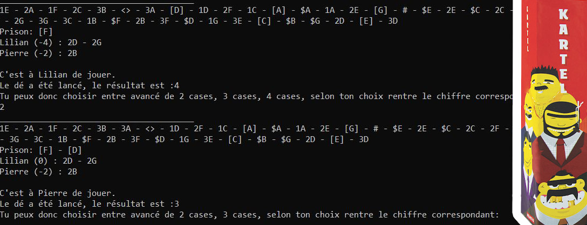

# Project

It's a simple console application reproducing of the already existing board game '[Kartel](https://boardgamegeek.com/boardgame/244584/kartel "")', all players play on the same computer.



This project was made for a 1st year license study project.

### Features 

All the rules of the original game are present, plus a new type of token. You can view the rules from the app, or find them in the 'docs' folder.

# Built with 

The project was made in Java.

# Get and use project

### Prerequisites

1. You need [Java](https://www.java.com/ "").

### Installation 

1. Clone the repo. 
```
git clone https://github.com/LilianLeVrai/Kartel_game.git
```
2. Compile java files from 'src' folder. 
```
java ./kartel_game/*.java
```
3. Create the executable (.jar) from 'src' folder.
```
jar cvmf manifest.mf kartel_game.jar kartel_game
```
4. Run the game. 
```
java -jar kartel_game.jar
```


# Documentation

you can find some documentation (report, class diagram,...) about this project in the 'docs' folder. 
This project being intended for a French professor, so this documentation and the comments of the code are in French.

# Contributors 

- [Lilian M.](https://github.com/LilianLeVrai "")
- Robin L.


